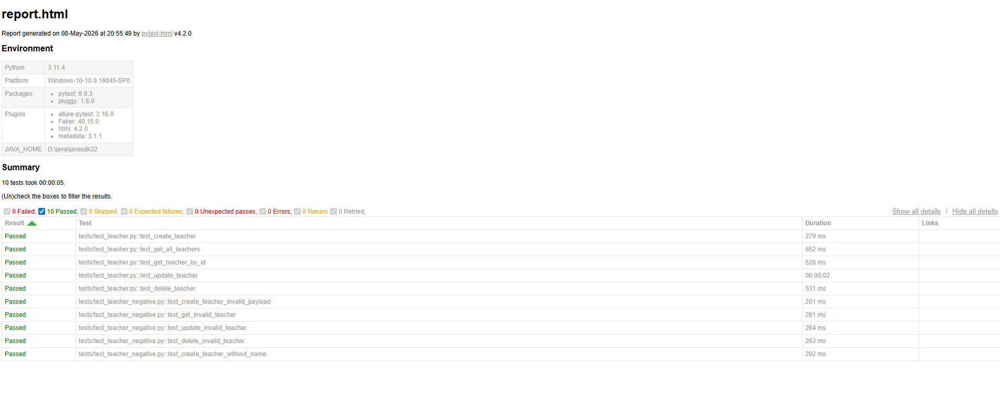
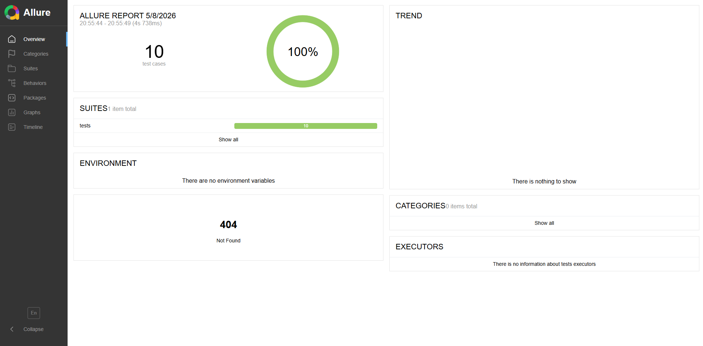

# Teacher API Automation Framework

A complete API Automation Framework built using **Python**, **Pytest**, and **Requests** for automating the Teacher APIs from the provided Swagger documentation.

---

# Project Overview

This project automates Teacher API testing by covering:

- Positive test scenarios
- Negative test scenarios
- CRUD operations
- Authentication handling
- Payload validation
- Reusable helper utilities
- HTML & Allure reporting
- Environment variable management
- Proper project structure

The framework follows clean automation design principles instead of putting everything in one file.

---

# Tech Stack

- Python 3
- Pytest
- Requests
- Faker
- Python-dotenv
- Pytest HTML Report
- Allure Report

---

# API Documentation Used

Teacher APIs were automated from:

http://54.255.195.111:5171/api-docs/#/

---

# Project Structure

```text
teacher-api-automation/
│
├── tests/
│   ├── conftest.py
│   ├── test_teacher.py
│   └── test_teacher_negative.py
│
├── utils/
│   ├── auth.py
│   ├── payloads.py
│   └── assertions.py
│
├── reports/
│   └── report.html
│
├── allure-results/
├── screenshots/
│
├── .env
├── requirements.txt
├── pytest.ini
└── README.md
```

---

# Features Implemented

## Authentication Handling

- Login token generation
- Dynamic Authorization header creation
- Reusable helper function

---

## Payload Management

Reusable payload generators using Faker.

Example:

```python
def generate_teacher_payload():
    return {
        "name": fake.name(),
        "email": fake.unique.email(),
        "department": "CSE",
        "teacherId": random.randint(1000, 99999),
        "designation": "Professor"
    }
```

---

# Test Coverage

The framework contains 10 API test cases.

---

## Positive Test Cases

| Test Case | Duration |
|---|---|
| test_create_teacher | 274ms |
| test_get_all_teachers | 656ms |
| test_get_teacher_by_id | 526ms |
| test_update_teacher | 1s 531ms |
| test_delete_teacher | 518ms |

---

## Negative Test Cases

| Test Case | Duration |
|---|---|
| test_create_teacher_invalid_payload | 214ms |
| test_get_invalid_teacher | 251ms |
| test_update_invalid_teacher | 267ms |
| test_delete_invalid_teacher | 266ms |
| test_create_teacher_without_name | 210ms |

---


# Environment Configuration

Sensitive data is managed using `.env`.

Example:

```env
BASE_URL=http://54.255.195.111:5000
USERNAME=admin
PASSWORD=password123
```

---

# Setup Instructions

## 1. Clone Repository

```bash
git clone <your-github-repo-link>
```

---

## 2. Navigate To Project

```bash
cd teacher-api-automation
```

---

## 3. Create Virtual Environment

### Windows

```bash
python -m venv venv
```

Activate:

```bash
venv\Scripts\activate
```

---

## 4. Install Dependencies

```bash
pip install -r requirements.txt
```

---

# Required Dependencies

```text
pytest
requests
faker
python-dotenv
pytest-html
allure-pytest
```

---

# Running Tests

## Run All Tests

```bash
python -m pytest
```

---

## Run Specific File

```bash
python -m pytest tests/test_teacher.py
```

---

## Run Specific Test

```bash
python -m pytest -k update_teacher
```

---

# HTML Report Generation

HTML report is automatically generated because of `pytest.ini`.

Example:

```ini
[pytest]
addopts = -v -s --html=reports/report.html --self-contained-html
```

---

## View HTML Report

Open:

```text
reports/report.html
```

in browser.

---

# HTML Report Screenshot

Place your HTML report screenshot inside the `screenshots/` folder.

Example:




---

# Allure Report Generation

## Generate Allure Results

```bash
python -m pytest --alluredir=allure-results
```

---

## Generate Allure HTML Report

```bash
allure generate allure-results -o allure-report --clean
```

---

## Open Allure Report

Open:

```text
allure-report/index.html
```

in browser.

---

# Allure Report Screenshot

Place your Allure report screenshot inside the `screenshots/` folder.

Example:



---


---

# Framework Design Principles

This framework follows:

- DRY Principle
- Reusable helper functions
- Modular architecture
- Clean folder structure
- Environment-based configuration
- Scalable automation design

---

# Reporting

The framework supports:

- HTML Reports
- Allure Reports

This helps in:

- Better test visibility
- Failure analysis
- Professional reporting
